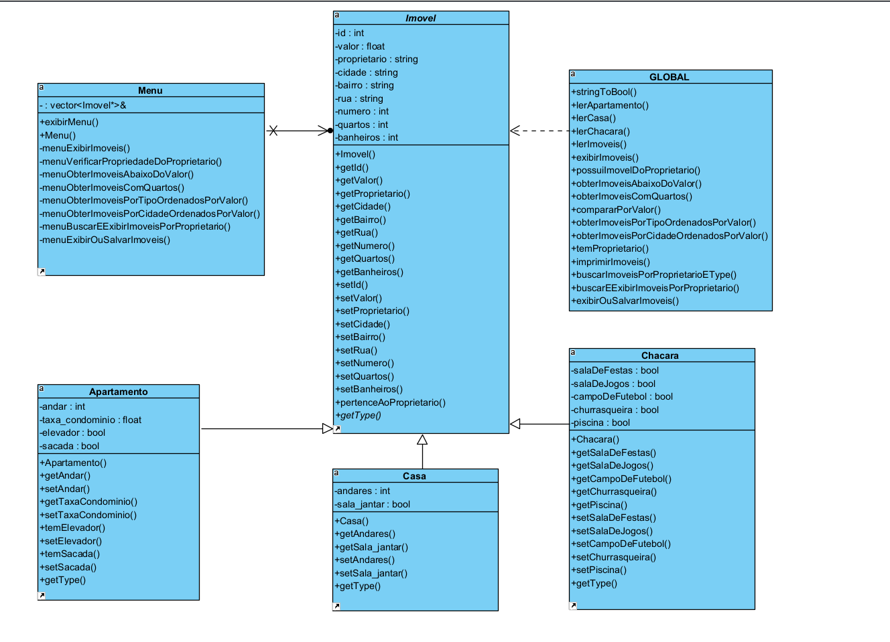
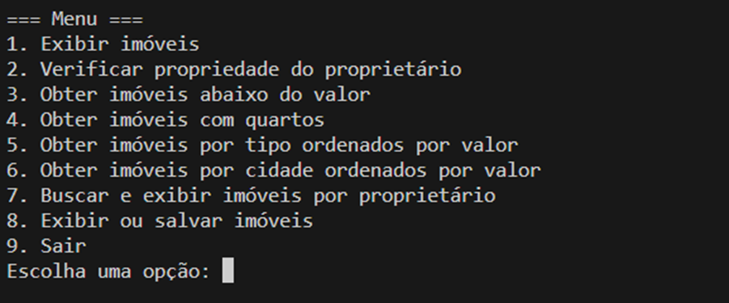

# Corretora de Imóveis em C++

## Descrição do Projeto

Este projeto é a implementação de um sistema de corretora de imóveis em C++, utilizando os princípios da Programação Orientada a Objetos (POO). O objetivo é criar uma estrutura de classes que represente de forma fiel diferentes tipos de imóveis — como "Chacara", "Casa" e "Apartamento" — permitindo uma gestão intuitiva e eficaz através de um menu interativo no console. O projeto demonstra a aplicação prática da Standard Template Library (STL) e de uma organização de código modular para a gestão de propriedades imobiliárias.

## 📜 Funcionalidades

O menu interativo oferece as seguintes opções:

- [x] **Exibir imóveis**: Mostra todos os imóveis cadastrados.
- [x] **Verificar propriedade do proprietário**: Verifica se um determinado proprietário possui algum imóvel no sistema.
- [x] **Obter imóveis abaixo do valor**: Retorna uma coleção de imóveis com valor igual ou inferior a um limite especificado.
- [x] **Obter imóveis com quartos**: Filtra e exibe imóveis com um número de quartos igual ou superior ao especificado.
- [x] **Obter imóveis por tipo ordenados por valor**: Exibe imóveis de um tipo específico, ordenados pelo valor.
- [x] **Obter imóveis por cidade ordenados por valor**: Mostra os imóveis de uma cidade, ordenados por valor.
- [x] **Buscar e exibir imóveis por proprietário**: Busca e exibe todos os imóveis de um proprietário específico.
- [x] **Exibir ou salvar imóveis**: Permite ao usuário escolher entre exibir os dados no terminal ou salvá-los em um arquivo de texto (`saida.txt`).
- [x] **Sair**: Encerra a execução do programa.

## 🛠️ Tecnologias Utilizadas

- **C++**: Linguagem de programação principal do projeto.
- **Programação Orientada a Objetos (POO)**: Paradigma utilizado para a modelagem do sistema, com conceitos como herança e polimorfismo.
- **Standard Template Library (STL)**: Utilizada para a manipulação de dados, principalmente através do contêiner `vector` para armazenar os imóveis.

## 🏛️ Arquitetura do Projeto

O sistema é estruturado com uma classe base `Imovel` e três classes derivadas: `Chacara`, `Casa` e `Apartamento`. Essa hierarquia permite a representação eficaz dos diferentes tipos de propriedades.

A interação com o usuário é gerenciada pela classe `Menu`, enquanto funções auxiliares para manipulação de dados e lógicas específicas estão contidas no arquivo `funcoes.cpp`.

### Diagrama de Classes UML

A imagem a seguir ilustra a estrutura das classes e seus relacionamentos.



### Exemplo de Execução

Abaixo, um exemplo da interface do programa em execução:



## 🚀 Como Executar

Para compilar e executar o projeto, siga os passos abaixo.

**1. Compilação**

Abra o terminal na pasta raiz do projeto e execute o seguinte comando `g++`:

```bash
g++ -Wall imovel.cpp apartamento.cpp casa.cpp chacara.cpp menu.cpp funcoes.cpp main.cpp -o bin/corretora
```

Caso um `Makefile` esteja disponível, você pode simplesmente usar o comando:

```bash
make
```

Execução

Após a compilação bem-sucedida, acesse a pasta `bin` execute o programa com o comando:

```bash
./corretora
```
